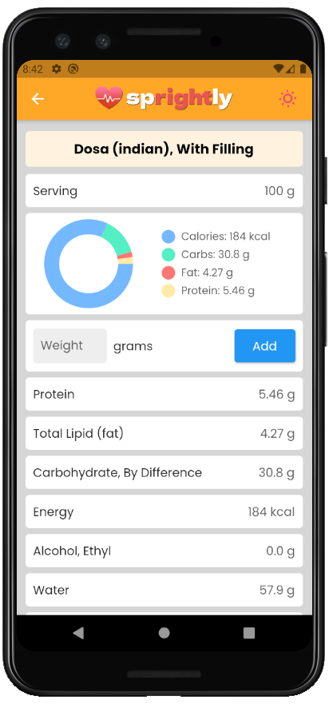
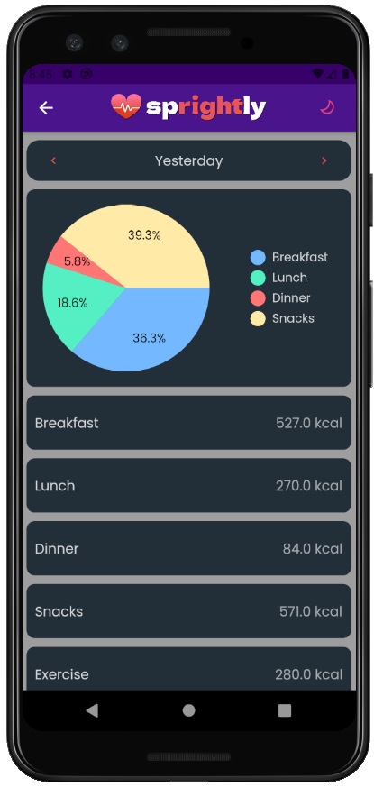

     

# Sprightly - A Diet Monitoring App 

* Sprightly is an app built for the health-conscious, who are willing to go an extra step in monitoring their health and improving their fitness. 
* Based on one’s weight, height, age and goals, Sprightly provides a personalized recommendation for a daily calorie intake and also stores the number of calories he/she has burned by exercising.
* It contains a well-designed food diary, with a detailed food description and a dedicated global dark mode.
* Main technologies used: Flutter & Firebase

# Screenshots

 &nbsp; &nbsp;   
 &nbsp; &nbsp;   
 &nbsp; &nbsp;   
 &nbsp; &nbsp;   

* Developed by: Akshat Joshi & Suresh Kumar Chaturvedi
